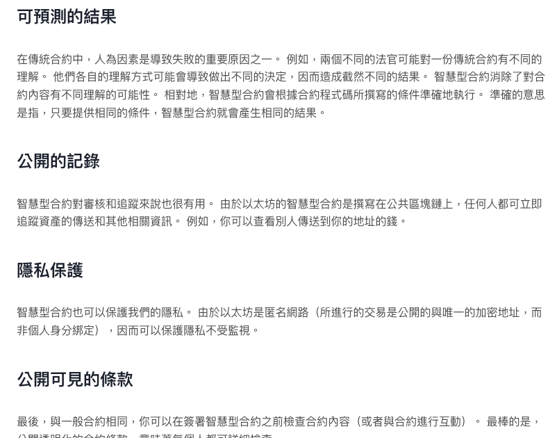

# 以太坊與加密貨幣

## 什麼是以太坊？

---

以太坊是一個開源的區塊鏈平台（網路）。 以太坊是分布在全世界的不同電腦組成的網路，這些網路都遵守 Ethereum protocol 以太坊網路是建立與使用的社群、應用程式、組織、數位資產的基礎（任何人都可以建立與使用）

**https://ethereum.org/** 是以太坊（Ethereum）的官方網站，網站的建立並不是由單一間公司所擁有或建立，而是由以太坊社區共同建立和維護。

以太坊的創立者是 Vitalik Buterin，他於 2013 年提出了以太坊的概念。然而，以太坊的發展和維護是由全球的開發者社群共同參與和貢獻的，並且有以太坊基金會（Ethereum Foundation）作為支持組織。是一個獨立非營利組織，旨在**推動以太坊區塊鏈技術的發展和應用**。

## 加密貨幣

---

與貨幣相同，加密貨幣也是一種用來提升以物易物效率的東西，是一種用來描述以區塊鏈技術作為加密手段的同質化代幣（fungible digital tokens）

例如比特幣，他免除了需要對第三方的信任，而可以在兩個對象之間轉移的特性。在比特幣世界裡，大家只需要相信比特幣程式碼 （程式碼都是公開在網路上免費可以取得查看的），而非是基於你對第三方組織或者機構的信任（例如政府）。

叫做加密貨幣的原因是因為，他是基於密碼學來保障安全性的。

:::caution 注意事項

加密貨幣不完全等於虛擬貨幣，準確來說加密貨幣算是虛擬貨幣的子集合，而虛擬貨幣是個通稱，他泛指儲存在數位媒介當中的貨幣。 如：加密貨幣、楓之谷楓幣

:::

加密貨幣有以下特性：

1. 全球通用，不必經過轉換
2. 無法偽造：加密貨幣由加密技術來確保不可偽造性
3. 防止通膨、不依賴中央政府或單位，是完全以區塊鏈完成 ⇒ 不會在發行後又被大量印製造成通膨

## 以太幣 (ether, ETH)

---

以太坊有自己的原生加密貨幣，稱為以太幣 (ether, ETH)，他的用處是支付在以太坊網路上的任何活動，例如支付在以太坊上面建構與運行應用程式所需要的計算費用。ETH 也可以在不同用戶之間轉移，換取 ETH 或者其他加密貨幣。

## 智能合約

---

以太坊在每個運作的節點上都運行著一個以太坊虛擬機 (Ethereum Virtual Machine, EVM)，用來執行智能合約**(Smart Contract)。

智能合約是一個儲存在區塊鏈上的一個程式，因為他是程式，具有極高邏輯性，且寫成了就不能改變了這就解決了傳統合約的一些問題，例如履行性的問題，在口頭或是紙筆契約已經在法律上成立，但很多時候對方如果不履行，是有機會你也不能拿他怎樣的。

智慧型合約將協議轉化成數位形式，也就是將協議條款轉變成電腦程式碼，並在符合合約條款時自動執行，就確保了合約的可預測性，雙方不能早、也不能晚履行合約，同時也就沒有了信任問題。

以下是更多智能合約的好處 （擷取自 [以太坊官網](https://ethereum.org/)）

## DApp (Decentralize App)

---

利用 web3.js, ehters.js 及我們可以搭配前端技術搭建一個更易於操作智能合約的介面去與以太坊網路互動，這樣的 app 通稱為 DApp。

在 DApp 中，智能合約會用來實現所需的業務邏輯。

## Account 帳號

---

**Ethereum 有兩種帳號：**

1. Externally-owned account (EOA)：一般帳號，由具有 private keys 的人掌控。

   1. 不需創建費用 (gas fee)

   2. 可以起始一個 transaction

   3. EOA 之間只能交易 ETH/token

   4. 由一組 public key/private key 構成，共同管理帳戶的活動

      

2. Contract account: 部署到以太坊區塊鏈上的智能合約

   1. 需要付費
   2. 只能因為外部 transaction 被觸發，而發起 transaction
   3. 被觸發而執行的功能不只是交易 ETH/token，甚至可能創建帳號
   4. 不具有 private keys，是以智能合約中的邏輯管理的

**Ethereum 的帳號會具有四種欄位：**

1. nonce: 一個代表交易的計數值

2. balance: 這個地址的 wei 數（1e+18 wei per ETH.）

   > 以太坊區塊鏈上的最小單位，用於表示以太幣（ETH）和其他加密代幣的數量。以太坊的所有金額、交易費用（gas 費用）和餘額都是以 wei 為基礎來表示，這種微小的單位使我們能夠在區塊鏈上精確地處理各種金額

3. codeHash

4. storageRoot

## 非同質化代幣 (Non-fungible token)

---

- 一樣的物品如何區分出不同的價值，如：兩張百元鈔票，一張有明星簽名，一張沒有，有明星簽名的實際上會值錢一點
- 區塊鏈技術可以用來做到非同質化這件事
